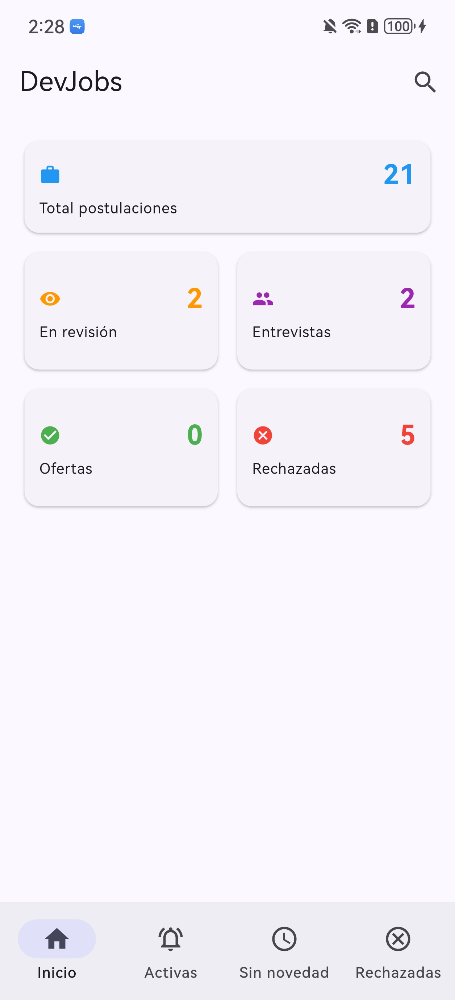
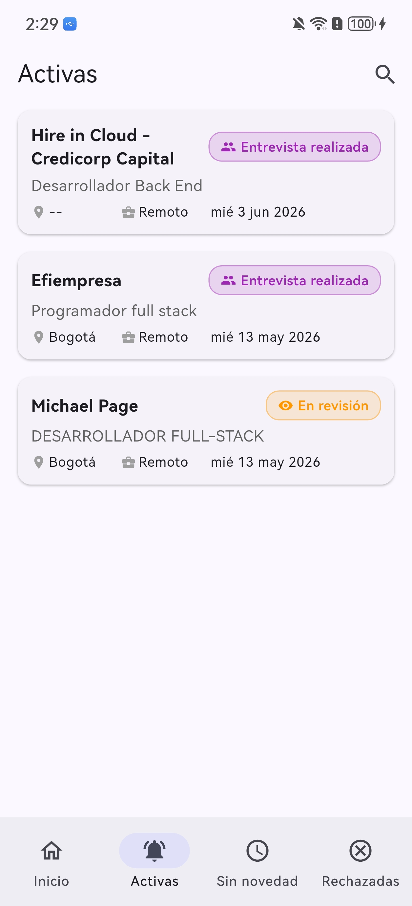
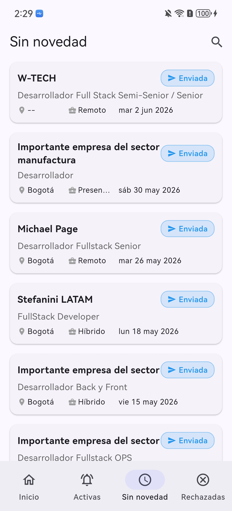
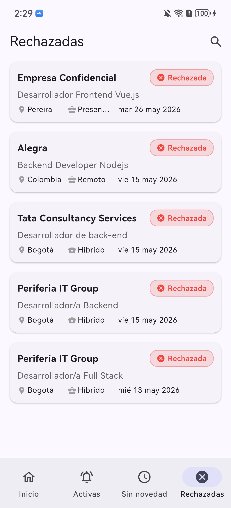
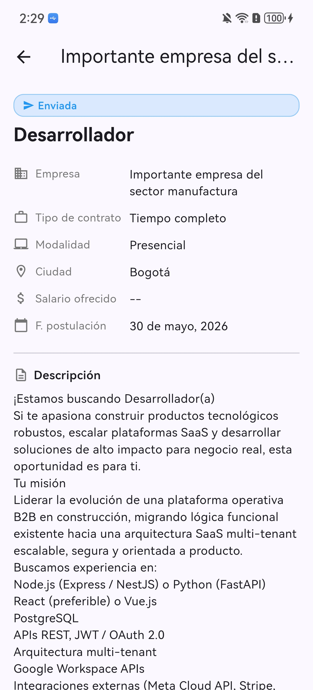

# 💼 devjobs

Aplicación Flutter para la gestión y búsqueda de ofertas de empleo.

## 📸 Capturas

| | | |
|---|---|---|
|  |  |  |
|  |  | |

## 🛠️ Requisitos

| Herramienta | Versión |
|-------------|---------|
| Flutter | 3.44.1 |
| Dart (pubspec constraint) | `^3.12.1` |
| Dart (bundled) | 3.12.1 |
| DevTools | 2.57.0 |

- Dispositivo o emulador configurado para ejecución física
- Conexión a internet para `flutter pub get`

## 📱 Permisos

| Permiso | Android | Propósito |
|---------|---------|-----------|
| `INTERNET` | ✅ Requerido | Llamadas HTTP al Apps Script (Google Sheets) |

La app requiere permiso de **Internet** para comunicarse con la API REST del Apps Script. Este permiso se declara en `android/app/src/main/AndroidManifest.xml` y se incluye automáticamente en el APK.


## 🚀 Comandos

| Acción | Comando |
|--------|---------|
| Ejecutar (debug) | `flutter run` |
| Ejecutar (release) | `flutter run --release` |
| Analizar código | `flutter analyze` |
| Ejecutar tests | `flutter test` |
| Obtener paquetes | `flutter pub get` |
| Limpiar build | `flutter clean` |

## 📱 Seleccionar dispositivo

Listar dispositivos conectados y emuladores:

```bash
flutter devices
```

Ejecutar en un dispositivo específico:

```bash
flutter run -d <device_id>
```

Ejemplos:

```bash
flutter run -d chrome        # Navegador web
flutter run -d emulator-5554 # Emulador Android
flutter run -d macos         # macOS (desktop)
flutter run -d ios           # iOS simulator
```

## 📦 Despliegue

### Android — APK / App Bundle

```bash
flutter build apk --release  # Genera build/app/outputs/flutter-apk/app-release.apk
flutter build appbundle      # Genera build/app/outputs/bundle/release/app-release.aab
```

### Web

```bash
flutter build web
```

### iOS (requiere macOS)

```bash
flutter build ios
```

### macOS

```bash
flutter build macos
```

## 🧪 Tests

```bash
# Todos los tests
flutter test

# Tests de un archivo específico
flutter test test/widget_test.dart
```

## 🧹 Linter

El proyecto usa `flutter_lints` con la configuración por defecto de Flutter.

```bash
flutter analyze
```

## 📊 Google Sheets

La app se conecta a una Google Sheet como fuente de datos. La hoja contiene dos pestañas:

| Pestaña | Contenido |
|---------|-----------|
| **Dashboard** | Resumen con totales: postulaciones, en revisión, entrevistas, ofertas, rechazadas |
| **Postulaciones** | Detalle de cada postulación (12 columnas) |

### Columnas de Postulaciones

| # | Columna | Descripción |
|---|---------|-------------|
| A | Fecha Postulación | Fecha en que se envió la postulación |
| B | Empresa | Nombre de la empresa |
| C | Vacante | Título del cargo |
| D | Tipo de Contrato | Tiempo completo / Temporal / Freelance |
| E | Modalidad | Remoto / Presencial / Híbrido |
| F | Ciudad | Ubicación de la vacante |
| G | Salario Ofrecido | Salario o rango salarial |
| H | Estado | Enviada / En revisión / Entrevista realizada / Oferta recibida / Rechazada |
| I | Link | URL de la oferta original |
| J | Descripción/Notas | Descripción completa de la vacante |
| K | Fecha Seguimiento | Fecha del último seguimiento |
| L | Contacto | Nombre del reclutador o contacto |
| M | Comentarios | Notas internas separadas por `- ` (guion + espacio) |

### Apps Script — API REST

La Google Sheet no expone datos directamente. Para conectarla a la app se usa un **Google Apps Script** que actúa como API REST.

**1. Crear el script**

1. Abre la hoja → **Extensiones → Apps Script**
2. Pega el código del archivo [`apps_script_code.example.gs`](apps_script_code.example.gs) en el editor
3. Guarda con `Ctrl+S` y asígnale un nombre al proyecto (ej. `DevJobs API`)

**2. Desplegar como Web App**

1. Clic en **Desplegar → Nueva implementación**
2. Tipo: **Web App**
3. Configuración:
   - **Ejecutar como** → Yo (tu cuenta)
   - **Acceso** → Cualquiera
4. Clic en **Desplegar**
5. Autoriza los permisos cuando se soliciten
6. **Copia la URL** generada (formato: `https://script.google.com/macros/s/.../exec`)

**3. Configurar la URL en la app**

1. Copia el archivo de ejemplo:
   ```bash
   cp .env.example .env
   ```
2. Edita `.env` y pega la URL del deployment:
   ```env
   API_URL=https://script.google.com/macros/s/TU_DEPLOYMENT_ID/exec
   ```
3. La app carga automáticamente las variables desde `.env` al iniciar.

> ⚠️ El archivo `.env` está en `.gitignore`. **Nunca** hagas commit de la URL real. Usa `.env.example` como referencia para otros desarrolladores.

### Acceso a la hoja

La hoja debe ser **públicamente visible** para que el script funcione con "Ejecutar como → Yo":
1. En la hoja → **Compartir → "Cualquier persona con el enlace" → Lector**

> ⚠️ *Nunca* compartas la URL del deployment del Apps Script públicamente. Se inyecta desde el archivo `.env` (ignorado por git).

---

## 📁 Estructura del proyecto

```
lib/
├── main.dart                           # MultiProvider + entrada de la app
├── config.dart                         # Carga API_URL desde .env
├── models/
│   └── job_application.dart            # Modelo (12 campos) + DashboardStats
├── providers/
│   └── app_state.dart                  # Estado global con caché (TTL 3 min)
├── services/
│   └── sheets_api_service.dart         # HTTP client para el Apps Script
├── helpers/
│   └── date_formatter.dart             # Formateo de fechas en español
├── screens/
│   ├── main_screen.dart                # BottomNavigationBar (Inicio/Activas/Sin novedad/Rechazadas)
│   ├── dashboard_screen.dart           # Dashboard con tarjetas de métricas
│   ├── applications_list_screen.dart   # Lista por pestaña con pull-to-refresh
│   ├── search_screen.dart              # Búsqueda global (todas las postulaciones)
│   └── application_detail_screen.dart  # Detalle + comentarios + descripción
└── widgets/
    ├── status_chip.dart                # Chip de estado (colores por estado)
    └── application_card.dart           # Card de postulación reutilizable
apps_script_code.example.gs                # Apps Script de ejemplo (con placeholder)
apps_script_code.gs                         # Copia local con tu SHEET_ID real (gitignored)
test/                                   # Tests unitarios y de widget
```

