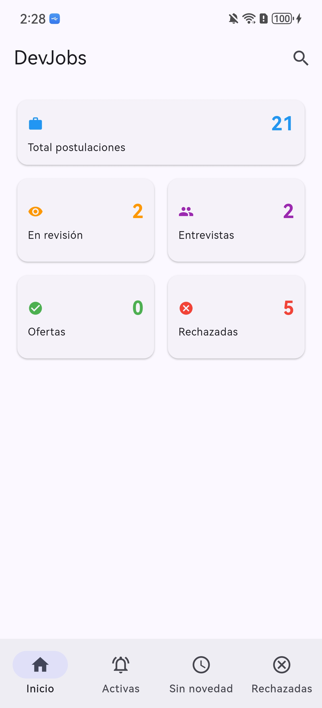
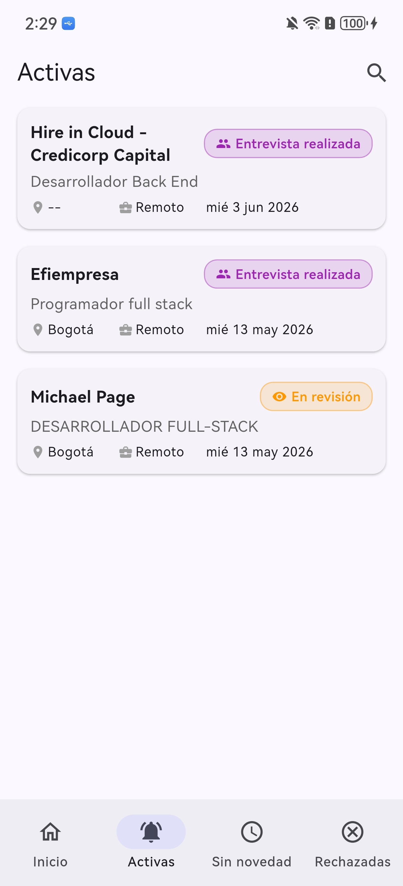
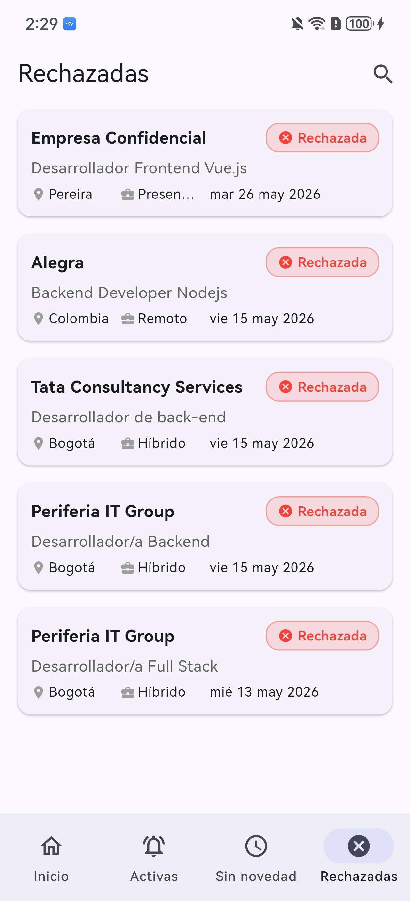
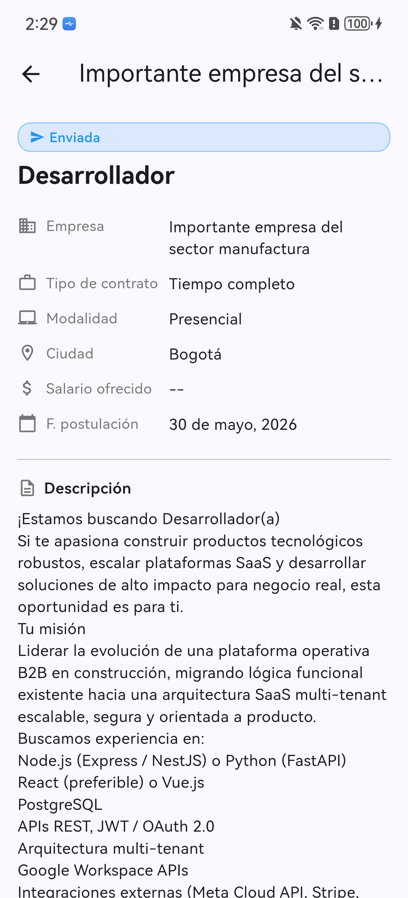

# 💼 DevJobs

Aplicación Flutter para el seguimiento de postulaciones laborales. Conectada a Google Sheets vía Apps Script como backend, permite registrar, filtrar y dar seguimiento a ofertas de empleo con dashboard de métricas interactivas, estados personalizados, indicadores por checkbox (entrevista realizada y **por gestionar**), tiempo del proceso, **tema claro/oscuro**, **búsqueda global sin tildes** y **apertura directa del enlace de la oferta**.

## 📸 Capturas

| | | |
|---|---|---|
|  |  |  |
|  |  | |

## 🛠️ Requisitos

| Herramienta | Versión |
|-------------|---------|
| Flutter | 3.44.1 |
| Dart (pubspec constraint) | `^3.12.1` |
| Dart (bundled) | 3.12.1 |
| DevTools | 2.57.0 |

- Dispositivo o emulador configurado para ejecución física
- Conexión a internet para `flutter pub get`

## 📦 Dependencias

| Paquete | Versión | Propósito |
|---------|---------|-----------|
| `flutter` | SDK | Framework UI multiplataforma |
| `flutter_localizations` | SDK | Textos Material y selector de fecha en español |
| `http` | `^1.6.0` | Cliente HTTP para consumir la API REST del Apps Script |
| `provider` | `^6.1.5+1` | Estado global con `ChangeNotifier` (caché, pestañas, filtros) |
| `intl` | `^0.20.2` | Formateo de fechas en español |
| `flutter_dotenv` | `^6.0.1` | Carga de variables de entorno desde archivo `.env` |
| `url_launcher` | `^6.3.3` | Abrir el enlace de la oferta en el navegador externo (Android/Linux/Windows) |
| `flutter_markdown_plus` | `^1.0.12` | Render de la descripción Markdown en el detalle y la vista previa |
| `markdown` | `^7.3.1` | AST para personalizar los encabezados Markdown con iconos |
| `package_info_plus` | `^10.2.2` | Versión y build del paquete instalado (Ajustes → Acerca de) |
| `flutter_lints` (dev) | `^6.0.0` | Reglas de lint por defecto de Flutter |

> `url_launcher` requiere declarar los intents `VIEW` para `https` y `http` en el
> bloque `<queries>` de `android/app/src/main/AndroidManifest.xml` (Android 11+).

## 📱 Permisos

| Permiso | Android | Propósito |
|---------|---------|-----------|
| `INTERNET` | ✅ Requerido | Llamadas HTTP al Apps Script (Google Sheets) |

La app requiere permiso de **Internet** para comunicarse con la API REST del Apps Script. Este permiso se declara en `android/app/src/main/AndroidManifest.xml` y se incluye automáticamente en el APK.


## 🚀 Comandos

| Acción | Comando |
|--------|---------|
| Ejecutar (debug) | `flutter run` |
| Ejecutar (release) | `flutter run --release --no-tree-shake-icons` |
| Analizar código | `flutter analyze` |
| Ejecutar tests | `flutter test` |
| Obtener paquetes | `flutter pub get` |
| Limpiar build | `flutter clean` |
| Build Android (APK) | `flutter build apk --release --no-tree-shake-icons` |
| Build Windows | `flutter build windows --release --no-tree-shake-icons` |
| Build Linux | `flutter build linux --release --no-tree-shake-icons` |
| Build con datos de compilación | `./scripts/build.sh linux` · `windows` · `apk` · `linux-install` |
| Ejecutar con datos de compilación | `./scripts/build.sh run` |
| Subir versión | `./scripts/bump-version.sh [build\|patch\|minor\|major]` |

> Los builds que se distribuyen deben hacerse con `scripts/build.sh`: inyecta
> commit, fecha y marca de cambios sin commitear. Sin él, **Ajustes → Acerca de
> DevJobs** muestra "No disponible" en commit y fecha (la versión siempre sale
> del `pubspec.yaml`).
>
> **Versionado:** la versión nunca se auto-incrementa al compilar. Antes de
> compilar un cambio, súbela con `./scripts/bump-version.sh` (por defecto suma
> 1 al build number; `patch`/`minor`/`major` según el alcance del cambio).

## 📱 Seleccionar dispositivo

Listar dispositivos conectados y emuladores:

```bash
flutter devices
```

Ejecutar en un dispositivo específico:

```bash
flutter run -d <device_id>
```

Ejemplos:

```bash
flutter run -d chrome        # Navegador web (requiere habilitar web/)
flutter run -d emulator-5554 # Emulador Android
flutter run -d linux         # Linux desktop
flutter run -d macos         # macOS (desktop, requiere macOS)
flutter run -d ios           # iOS simulator (requiere macOS)
```

## 📦 Despliegue

Todos los artefactos quedan dentro de `build/` (carpeta ignorada por git — se regenera con cada build).

### Versión y compilación

La app muestra en **Ajustes → Acerca de DevJobs** la versión del `pubspec.yaml`
(`version: X.Y.Z+N`), el commit, la fecha de compilación, la plataforma y el
canal (`release`/`debug`). Para saber si la instalación está al día:

```bash
git log -1 --oneline   # si el commit no coincide con el de la app, falta compilar
```

La versión la lee `package_info_plus` del paquete instalado (siempre coincide con
el `pubspec.yaml`). **No se auto-incrementa al compilar**: para subirla usa
`./scripts/bump-version.sh` (por defecto suma 1 al build number; `patch`,
`minor` o `major` según el alcance del cambio) y compila después. El commit y
la fecha solo viajan si el build se hizo con `scripts/build.sh`, que los inyecta
con `--dart-define`; sin él la pantalla muestra "No disponible" en esas dos
filas. Un `*` junto al commit significa que se compiló con cambios sin
commitear.

### Android — APK / App Bundle

```bash
flutter build apk --release
# Salida: build\app\outputs\flutter-apk\app-release.apk  (~50 MB)

flutter build appbundle
# Salida: build\app\outputs\bundle\release\app-release.aab
```

Instalar directamente en un dispositivo/emulador conectado (sin pasar por el archivo):

```bash
flutter install --release                    # dispositivo único conectado
flutter install --release -d <device_id>     # dispositivo específico (ver `flutter devices`)
```

### Windows

La plataforma Windows debe estar habilitada (carpeta `windows/` en la raíz del proyecto). Si no existe:

```bash
flutter create --platforms=windows .
```

Build de release:

```bash
flutter build windows --release
# Salida: build\windows\x64\runner\Release\devjobs.exe
```

La app abre en una **ventana de 420×880 centrada** (diseño mobile-first; es redimensionable) y su ícono se genera desde `assets/icon/icon.png` con `flutter_launcher_icons` (config `windows.generate` en `pubspec.yaml`; regenerar con `dart run flutter_launcher_icons`).

> ⚠️ Para distribuir o mover la app hay que copiar **toda la carpeta** `build\windows\x64\runner\Release\` (el `.exe` + DLLs + carpeta `data\`), no solo el `devjobs.exe`. Para una PC sin Flutter, comprime esa carpeta y en la destino ejecuta `devjobs.exe`.

Para probar en local sin compilar: `flutter run -d windows`.

#### Instalador — Inno Setup (opcional)

Para generar un `DevJobsSetup.exe` con acceso directo en Escritorio/Menú Inicio y desinstalador:

1. Instala **Inno Setup 6+** (gratis): <https://jrsoftware.org/isinfo.php>
2. Compila la app: `flutter build windows --release`
3. Genera el instalador:

```bash
"C:\Program Files (x86)\Inno Setup 6\ISCC.exe" installer\devjobs.iss
# Salida: installer\Output\DevJobsSetup.exe
```

El script es [`installer/devjobs.iss`](installer/devjobs.iss) (incluye nombre, versión, ícono y tareas de acceso directo). Sin Inno Setup instalado, la app se distribuye igual en portable (paso anterior).

### Linux

La plataforma Linux debe estar habilitada (carpeta `linux/` en la raíz del proyecto). Si no existe:

```bash
flutter create --platforms=linux .
```

Antes de compilar por primera vez, instala el toolchain (Ubuntu/Debian) y verifícalo con `flutter doctor`:

```bash
sudo apt install clang cmake ninja-build pkg-config libgtk-3-dev liblzma-dev
flutter doctor -v   # "Linux toolchain" debe quedar en verde
```

Build de release:

```bash
flutter build linux --release --no-tree-shake-icons
# Salida: build/linux/x64/release/bundle/devjobs
```

`--no-tree-shake-icons` es obligatorio en release (bug del tree-shaker de íconos: ver [AGENTS.md](AGENTS.md) → Comandos).

La app abre en una **ventana de 420×880 centrada** (mismo criterio mobile-first que Windows; tamaño mínimo 360×600). El icono de la ventana sale de `linux/devjobs.png` (256×256, generado desde `assets/icon/icon.png`) y se copia junto al binario.

Para probar en local sin compilar: `flutter run -d linux`.

> ⚠️ Para distribuir o mover la app hay que copiar **toda la carpeta** `build/linux/x64/release/bundle/` (binario + `data/` + `lib/`), no solo el ejecutable.
>
> ⚠️ El binario enlaza contra la glibc del sistema donde se compiló: lo compilado en Ubuntu 26.04 puede no correr en distros más viejas. Si necesitas compatibilidad amplia, compila dentro de un contenedor con la versión más antigua que quieras soportar.

#### Instalación local — `.desktop` + `install-linux.sh`

Instala la app en tu perfil (sin `sudo`), con entrada en el menú de aplicaciones e icono:

```bash
flutter build linux --release --no-tree-shake-icons
./scripts/install-linux.sh              # instalar / actualizar
./scripts/install-linux.sh --uninstall  # desinstalar
```

Destinos: `~/.local/opt/devjobs` (bundle completo), `~/.local/bin/devjobs` (symlink), `~/.local/share/applications/devjobs.desktop` y `~/.local/share/icons/hicolor/256x256/apps/devjobs.png`. Si `~/.local/bin` no está en el `PATH`, el script te recuerda cómo agregarlo.

La entrada de escritorio está en [`linux/devjobs.desktop`](linux/devjobs.desktop) y usa `APPLICATION_ID=com.example.devjobs` (el mismo identificador que Android).

### Web (opcional, plataforma no habilitada)

El repositorio no incluye la carpeta `web/`. Para habilitar la versión web:

```bash
flutter create --platforms=web .
flutter build web --release
# Salida: build/web/
```

### iOS (requiere macOS)

```bash
flutter build ios
# Salida: build\ios\iphoneos\Runner.app
```

### macOS

```bash
flutter build macos
# Salida: build\macos\Build\Products\Release\
```

> 📝 El `.env` (con `API_URL` y, si usas la importación con IA, `AI_API_KEY`) se embebe en el bundle durante el build — asegúrate de tenerlo configurado antes de compilar cualquier plataforma.

## 🧪 Tests

```bash
# Todos los tests
flutter test

# Tests de un archivo específico
flutter test test/widgets/application_form_test.dart
```

La suite cubre helpers, modelos, proveedor, servicios, temas y widgets. Incluye pruebas de layout a **360 px** y de renderizado en **tema claro/oscuro**.

## 🧹 Linter

El proyecto usa `flutter_lints` con la configuración por defecto de Flutter.

```bash
flutter analyze
```

## 📊 Google Sheets como fuente de datos

La app se conecta a una **Google Sheet** como backend. No necesita servidor propio — usa un **Google Apps Script** desplegado como Web App que actúa como API REST (lectura y escritura).

| Sección | Contenido |
|---------|-----------|
| **Dashboard** | Resumen con totales: postulaciones, activas, **con entrevista** y finalizadas. Cards clickeables (Activas → Postulaciones con filtro Activas, Finalizadas → Postulaciones con filtro Finalizadas) con indicador visual `›`. La **Tasa de conversión** muestra “Con respuesta” (por estado), “A entrevista” (switch N) y “Finalizadas”. **Actividad reciente** muestra los conteos de 7/30 días y los últimos 3 movimientos. En el **Pipeline**, cada etapa es tocable y abre sus postulaciones. **Ritmo mensual** muestra las postulaciones de los últimos 6 meses. **Salario ofrecido** muestra promedio y rango por moneda (COP/USD), con abreviaturas (`5,9M`, `100K`) e interpreta rangos y dólares |
| **Postulaciones** | Listado con pills Todas/Activas/Enviadas/Finalizadas, búsqueda global con contador y acceso al detalle |
| **Agenda** | Cuarto tab con badge. Secciones **Por gestionar**, **Entrevistas agendadas** y **Ofertas recibidas**; hasta 5 filas por sección y “Ver todas” al listado completo |
| **Empresas** | Listado con buscador, **filtros por comportamiento** (Todas · Con análisis · Priorizar · No responde · Da feedback · Sin feedback · Vacantes estancadas) y barra de orden: Más postulaciones, Más activas, Más entrevistas, Mejor respuesta, **Recomendación** y Recientes. Cada card tiene jerarquía limpia: nombre a todo el ancho, subtítulo `total · activas · última actividad`, y si la empresa tiene análisis, una fila con su chip de **recomendación** y hasta 2 **etiquetas** IA en labels compactos (para que quepan en una línea; el detalle muestra los textos completos). Las métricas van planas y solo "por gestionar" lleva color. El detalle incluye métricas, distribución, el **Análisis IA** de su comportamiento y sus vacantes. Botón **Combinar** para unificar empresas duplicadas renombrando sus postulaciones |
| **Detalle** | Estado, datos, tiempo del proceso, **enlace externo con Abrir/Copiar** (antes de comentarios y descripción; aviso si el enlace no es válido), comentarios, descripción, entrevista, botón **Agregar nota** con fecha y botón **Finalizar proceso** (estado final, fecha editable y nota opcional) |
| **Crear / editar** | Formulario único en tres secciones (Vacante / Proceso / Notas). El FAB **Nueva** de Postulaciones crea; el lápiz del detalle edita. Valida empresa, vacante y fecha, avisa si el link ya está registrado (al salir del campo y al guardar) y vuelve a la lista al guardar. Al escribir la **Empresa** sugiere empresas registradas parecidas (aviso con chips **"Usar …"**, nunca automático) y ofrece el enlace **¿Sin nombre? Usar "Empresa confidencial"** cuando el campo está vacío |
| **Importar con IA** | Tarjeta **Autocompletar con IA** dentro de Nueva postulación (solo si hay proveedor y al menos un modelo configurados). Pega un link o la descripción y la IA prellena los campos; la descripción se guarda como resumen Markdown por secciones y se renderiza en el detalle |
| **Ajustes** | Ícono de engranaje en el AppBar. Tema **Sistema**, **Claro** u **Oscuro** (se aplica al instante y se recuerda) y acceso a la configuración de la **importación con IA**: proveedor y lista de modelos con respaldo automático |

### Búsqueda global

La lupa del AppBar busca en empresa, vacante, ciudad, contacto, tipo de contrato, modalidad, salario, descripción, **estado**, **comentarios**, **enlace** y **plataforma**. Ignora mayúsculas y tildes (`Bogota` encuentra “Bogotá”), acepta varias palabras en AND (`acme remoto`) y muestra un contador **“N resultados”** con opción de limpiar la búsqueda.

### Tema y apariencia

El menú de ajustes del AppBar permite elegir entre **Sistema**, **Claro** y **Oscuro**. El cambio se aplica de inmediato y se persiste en `SharedPreferences`, por lo que se mantiene después de cerrar y volver a abrir la app. En el mismo menú está la sección **Importación con IA**, que abre la pantalla de configuración de proveedor y modelos. Los temas están definidos en `lib/theme.dart` con tokens de color para ambos modos.

### Importar con IA

La app puede prellenar el formulario a partir del **enlace** de una vacante o del **texto de su descripción**. La función solo existe si hay un proveedor y al menos un modelo configurados; sin ellos, el formulario se ve exactamente igual que antes.

**Configuración**

1. Crea una API key en [OpenCode Console](https://opencode.ai/console) → **Account** → **Personal API keys**.
2. **Desde la app (recomendada):** **Ajustes → Importación con IA**. Pones la *Base URL*, la *API key* y la lista de modelos; se guarda en el dispositivo y aplica sin recompilar.
3. **Desde `.env` (semilla):**
   ```env
   AI_API_KEY=oc_sk_...
   AI_BASE_URL=https://opencode.ai/inference/go/openai/v1
   AI_MODEL=deepseek-v4.1-flash
   ```
   `AI_BASE_URL` y `AI_MODEL` son opcionales: si faltan, se usan OpenCode Go y DeepSeek V4.1 Flash. `AI_MODEL` admite **uno o varios modelos separados por comas** (`AI_MODEL=deepseek-v4.1-flash,glm-5.3-flash`); el primero es el principal. Los valores del `.env` solo dan el **inicio**: si ya guardaste una configuración en la app, esa es la que manda.

**Respaldo entre modelos**

En **Ajustes → Importación con IA** puedes agregar varios modelos y reordenarlos. El primero es el modelo principal; si falla por **cuota agotada** (429), **clave no habilitada** (401/403), **modelo no disponible** (404) o **proveedor caído** (5xx), la app prueba el siguiente automáticamente. Un error de **red** o una **respuesta inválida** no cambia de modelo: son problemas de conexión o de calidad. Si todos fallan, el aviso lista los modelos intentados y ofrece **Configurar IA**. El botón **Restablecer a los valores del .env** borra lo guardado y vuelve a la semilla.

**Cómo se usa**

- Abre **Nueva** y toca **Autocompletar con IA**.
- Pega un enlace o la descripción y toca **Analizar**.
- La app intenta leer el JSON-LD `JobPosting` de la página; si no alcanza, consulta al modelo.
- La descripción se guarda como un **resumen Markdown** por secciones: `Resumen`, `Responsabilidades`, `Requisitos`, `Beneficios` y `Observaciones`. La app compone el Markdown; no depende de que el modelo acierte la sintaxis.
- En el **detalle** se renderiza con títulos, negritas, viñetas e iconos por sección. En el formulario puedes alternar **Vista previa** para verlo antes de guardar.
- El resumen suele quedar entre ~800 y 2.000 caracteres. Ya no se recorta la descripción a 4.000: se resume y se organiza.
- Solo rellena campos vacíos. Marca las secciones con un chip **IA**, muestra un resumen con avisos y permite **Vaciar IA** para revertir lo importado.
- Los campos que ya habías escrito a mano nunca se sobrescriben.

> 📄 **Google Sheets** guarda el Markdown como texto: en la celda vas a ver `##` y `**`. El formato con títulos, negritas e iconos se ve en la app.

**Qué no hace**

- No crea la postulación sin tu confirmación.
- No actualiza una postulación existente: si detecta el mismo enlace canónico, avisa y ofrece crear otra.
- No lee páginas con login, Indeed (HTTP 403) ni SPAs que no entregan texto; en esos casos pide pegar la descripción.
- No guarda la descripción original completa: guarda el resumen Markdown.
- No envía datos de la hoja ni datos personales: solo el texto de la vacante.

**Privacidad y límites**

- DeepSeek V4.1 Flash en OpenCode Go no entrena con los datos y tiene retención 0 días.
- Una importación tarda ~4–6 s y consume pocos miles de tokens del allowance de Go.
- La key queda en el build si viene del `.env`, y en `SharedPreferences` si la configuras desde la app. Es aceptable para uso personal; si compartes el binario, crea otra key o revócala.
- OpenCode Go está pensado para agentes de código. El uso personal de bajo volumen es razonable; si prefieres cero ambigüedad, cambia `AI_BASE_URL` a `https://opencode.ai/inference/openai/v1` (pay-as-you-go).
- El modelo principal es el primero de la lista de **Ajustes → Importación con IA** (`AI_MODEL` solo aporta la semilla inicial y admite varios modelos separados por comas). Si DeepSeek no está disponible, `glm-5.3-flash` es una alternativa con buena calidad de JSON.

### Analizar empresa con IA

Desde el **detalle de una empresa** (tab Empresas) la app puede generar un análisis del comportamiento de esa empresa en sus procesos de selección, con la misma configuración de proveedor y modelos de la importación.

**Qué analiza**

- Todas las postulaciones de la empresa: vacantes, estados, fechas, tipo de contrato, modalidad, ciudad, salario y canal de postulación (plataforma o correo).
- Las **notas** (`Comentarios`), donde se registran las novedades: respuestas, feedback, pruebas, etc.
- Métricas calculadas en la app (no por la IA): tasa de respuesta, días promedio hasta la primera respuesta, días promedio de cierre, activas estancadas, entrevistas y resumen salarial.

**Qué genera**

- **Etiquetas de comportamiento** de un vocabulario cerrado (`No responde`, `Respuesta lenta`, `Da feedback`, `Proceso ágil`, `Vacantes estancadas`…), pintadas como chips de colores.
- **Resumen** (2–4 frases), **Señales positivas**, **A tener en cuenta** y una **Recomendación** (Priorizar / Seguimiento normal / Baja prioridad / Precaución).
- Secciones expandibles: **Perfil de vacantes**, **Proceso de selección** y **Contactos** mencionados en las notas.

**Cómo se usa**

1. Abre el detalle de una empresa y toca **Analizar con IA** (aparece solo si hay IA configurada).
2. Al terminar, el análisis se guarda en la pestaña `EmpresaAnalisis` de la Sheet y queda visible en la tarjeta **Análisis IA**.
3. Si después hay postulaciones nuevas o novedades, la tarjeta avisa **"Datos desactualizados"** y ofrece **Reanalizar**. El disparador es manual: la app no gasta tokens sin que lo pidas.

**En el listado de Empresas**, cada empresa con análisis muestra su chip de **recomendación** y hasta 2 **etiquetas** de comportamiento; puedes ordenar por **Recomendación** (Priorizar primero, sin análisis al final) o **filtrar por comportamiento** con los chips del listado (Todas · Con análisis · Priorizar · No responde · Da feedback · Sin feedback · Vacantes estancadas).

> 📄 La pestaña `EmpresaAnalisis` se crea sola en el primer guardado. Si el análisis no se puede guardar en la Sheet (p. ej. un problema transitorio), se conserva en el dispositivo y se reintenta al reanalizar. Para **"Empresa confidencial"** (vacantes sin empresa real) el botón no aparece: ese agrupado mezcla empresas distintas y el análisis no tendría sentido.

### Combinar empresas (duplicados)

Cuando la misma empresa aparece con nombres distintos (`xpertgroup` / `xpertgroup sas`), el tab **Empresas** las unifica:

1. Toca **Combinar** (junto al contador de empresas).
2. La lista va en **orden alfabético** (así las nombres similares quedan juntas) y tiene **buscador**; marca las empresas que son la misma — la selección se conserva mientras buscas — y elige el **nombre final**.
3. Revisa la **vista previa** (qué filas se renombrarán) y confirma.

Las postulaciones seleccionadas se renombran al nombre final en el Sheet (la pestaña `Postulaciones` queda con un solo nombre). Los análisis IA no se mezclan: el del nombre final se queda como está y se marca **"Datos desactualizados"** (con un clic en **Reanalizar** obtienes el de la empresa combinada); los análisis de los nombres absorbidos quedan huérfanos en `EmpresaAnalisis` y puedes borrarlos a mano desde la Sheet.

**Avisos de posibles duplicados al crear/editar:** al escribir el nombre de la empresa, la app sugiere empresas registradas parecidas (sufijos, palabra raíz como `stefanini latam` ∼ `stefanini group`, errores de tipeo) con chips **"Usar …"** para adoptar el nombre existente. Es solo un aviso: nunca cambia lo que escribes, así que empresas parecidas pero distintas (p. ej. dos grupos de la misma organización) pueden convivir. Y si no sabes la empresa, el enlace **¿Sin nombre? Usar "Empresa confidencial"** (debajo del campo, solo con el campo vacío) rellena el nombre canónico para agrupar esos casos.

### Columnas de Postulaciones

| # | Columna | Descripción |
|---|---------|-------------|
| A | Fecha Postulación | Fecha en que se envió la postulación |
| B | Empresa | Nombre de la empresa |
| C | Vacante | Título del cargo |
| D | Tipo de Contrato | Tiempo completo / Tiempo Parcial / Por proyecto / Temporal / Freelance / Otro / Prestación servicios / Termino fijo / Obra labor |
| E | Modalidad | Remoto / Híbrido / Presencial / Otro |
| F | Ciudad | Ubicación de la vacante |
| G | Salario Ofrecido | Salario o rango salarial |
| H | Estado | Enviada / En revisión / Entrevista agendada / Entrevista realizada / Prueba técnica / Oferta recibida / Rechazada / Sin respuesta / Aceptada / Retirada |
| I | Link | URL de la oferta original |
| J | Descripción/Notas | Resumen Markdown de la vacante por secciones (se renderiza en el detalle) |
| K | Fecha Seguimiento | Fecha del último seguimiento |
| L | Contacto | Nombre del reclutador o contacto |
| M | Comentarios | Notas internas separadas por `- ` (guion + espacio) |
| N | ¿Entrevista? | Checkbox: indica si se realizó entrevista (✓ = sí) |
| O | Por gestionar | Checkbox: marca manual de vacantes con algo pendiente (prueba, ejercicio, documento). La razón se anota en `Comentarios`. No se auto-limpia; se ve en la sección "Por gestionar" de Agenda y no altera el orden de los listados |

### Columnas de EmpresaAnalisis

Pestaña con el análisis IA por empresa (una fila por empresa). Se crea sola al guardar el primer análisis.

| # | Columna | Descripción |
|---|---------|-------------|
| A | empresa | Nombre de la empresa (clave: se compara sin mayúsculas ni espacios sobrantes) |
| B | fechaAnalisis | Fecha en que se generó el análisis |
| C | datosAl | Última novedad incluida (seguimiento, postulación o nota): sirve para detectar el desfase |
| D | totalPostulaciones | Nº de postulaciones consideradas en el análisis |
| E | etiquetas | Etiquetas de comportamiento separadas por coma (`No responde, Da feedback`) |
| F | recomendacion | `Priorizar` / `Seguimiento normal` / `Baja prioridad` / `Precaución` |
| G | resumen | Síntesis en 2–4 frases |
| H | fortalezas | Señales positivas, una por línea con `- ` |
| I | riesgos | Señales negativas, una por línea con `- ` |
| J | perfilVacantes | Qué tipo de vacantes publica (roles, contratos, modalidades, salarios) |
| K | procesoSeleccion | Cómo es su proceso según las notas (etapas, pruebas, tiempos) |
| L | contactos | Personas mencionadas, una por línea con `- ` |

### Contrato de fechas

Las columnas A y K son celdas de **fecha** reales de Google Sheets (no texto). Para que el día/mes no se intercambie ni la fecha se corra un día:

| Paso | Formato | Responsable |
|------|---------|-------------|
| App → script | `yyyy-MM-dd` (`formatApiDate`) | Flutter |
| Script → celda | `Date` real: `Utilities.parseDate(iso, zona de la hoja, 'yyyy-MM-dd')` | Apps Script |
| Celda → script | `Date` | Sheets |
| Script → app | `d/M/yyyy` | Apps Script |

- La app **no** envía timestamps ni usa la zona horaria del dispositivo para guardar: solo año/mes/día.
- El script usa `Spreadsheet.getSpreadsheetTimeZone()`; no hay `GMT-5` hardcodeado.
- El selector de fecha es **solo calendario** y está en español (`flutter_localizations`), para eliminar el tecleo ambiguo.
- `GET ?action=meta` devuelve zona horaria, locale y formato de A/K para diagnosticar. Si `timeZone` y `scriptTimeZone` difieren, ajusta la zona del proyecto de Apps Script a la de la hoja (Project Settings → Time zone).
- **Al cambiar el script, redesplegar con Manage deployments → Edit → New version** para conservar la URL del `.env`.

### Apps Script — API REST

La Google Sheet no expone datos directamente. Para conectarla a la app se usa un **Google Apps Script** que actúa como API REST con los siguientes endpoints:

| Método | Endpoint | Acción |
|--------|----------|--------|
| `GET` | `?action=all` | Devuelve todas las postulaciones como JSON |
| `GET` | `?action=dashboard` | Devuelve totales computados |
| `GET` | `?action=meta` | Diagnóstico: zona horaria, locale, formato de fechas, primera fila de datos y rango del filtro |
| `GET` | `?action=companyInsights` | Devuelve los análisis IA por empresa (pestaña `EmpresaAnalisis`) |
| `POST` | `action: update` | Actualiza una fila existente (`rowIndex` + `updates`) |
| `POST` | `action: create` | Crea una postulación y devuelve `rowIndex` + `shifted` |
| `POST` | `action: upsertCompanyInsight` | Guarda (o actualiza) el análisis IA de una empresa en `EmpresaAnalisis` |

Las nuevas postulaciones quedan **encima** de la primera existente. Si la fila inmediatamente superior está vacía (sin valores, fórmulas ni notas), el script la rellena sin mover filas y responde `shifted: false`; en caso contrario inserta una fila, desplaza las existentes y responde `shifted: true` (la app refresca la lista).

> `rowIndex` es posicional: si insertas o borras filas directamente en el Sheet, haz **pull-to-refresh** en la app antes de editar una postulación.

El script está vinculado a la hoja, se despliega como **Web App** (Ejecutar como: Yo, Acceso: Cualquiera) y la URL se configura vía `.env`.

**1. Crear el script**

1. Abre la hoja → **Extensiones → Apps Script**
2. Pega el código del archivo [`apps_script_code.example.gs`](apps_script_code.example.gs) en el editor
3. Guarda con `Ctrl+S` y asígnale un nombre al proyecto (ej. `DevJobs API`)

**2. Desplegar como Web App**

1. Clic en **Desplegar → Nueva implementación**
2. Tipo: **Web App**
3. Configuración:
   - **Ejecutar como** → Yo (tu cuenta)
   - **Acceso** → Cualquiera
4. Clic en **Desplegar**
5. Autoriza los permisos cuando se soliciten
6. **Copia la URL** generada (formato: `https://script.google.com/macros/s/.../exec`)

**3. Configurar la URL en la app**

1. Copia el archivo de ejemplo:
   ```bash
   cp .env.example .env
   ```
2. Edita `.env` y pega la URL del deployment. Si vas a usar la importación con IA, agrega también la key:
   ```env
   API_URL=https://script.google.com/macros/s/TU_DEPLOYMENT_ID/exec

   AI_API_KEY=oc_sk_...
   AI_BASE_URL=https://opencode.ai/inference/go/openai/v1
   AI_MODEL=deepseek-v4.1-flash
   ```
   `AI_BASE_URL` y `AI_MODEL` son opcionales: si faltan, la app usa OpenCode Go y DeepSeek V4.1 Flash. Son la **semilla** inicial (`AI_MODEL` admite varios modelos separados por comas): desde **Ajustes → Importación con IA** puedes cambiar el proveedor y la lista de modelos sin recompilar. Sin `AI_API_KEY` ni configuración en la app, la tarjeta **Autocompletar con IA** no aparece.
3. La app carga automáticamente las variables desde `.env` al iniciar.

> ⚠️ El archivo `.env` está en `.gitignore`. **Nunca** hagas commit de la URL real. Usa `.env.example` como referencia para otros desarrolladores.

### Acceso a la hoja

La hoja debe ser **públicamente visible** para que el script funcione con "Ejecutar como → Yo":
1. En la hoja → **Compartir → "Cualquier persona con el enlace" → Lector**

> ⚠️ *Nunca* compartas la URL del deployment del Apps Script públicamente. Se inyecta desde el archivo `.env` (ignorado por git).

---

## 📁 Estructura del proyecto

```
lib/
├── main.dart                           # ChangeNotifierProvider + entrada de la app
├── config.dart                         # API_URL y configuración de IA desde .env
├── theme.dart                          # Tokens de color (claro/oscuro) + helpers semánticos
├── models/
│   ├── job_application.dart            # Modelo (16 campos) + DashboardStats + getters de tiempo
│   ├── job_import.dart                 # Resultado de importación, datos de IA y tipo de página
│   └── application_options.dart        # Opciones de contrato, modalidad y estado
├── providers/
│   └── app_state.dart                  # Estado global: caché (TTL 3 min), filtros y tema
├── services/
│   ├── sheets_api_service.dart         # HTTP client para el Apps Script
│   ├── job_import_service.dart         # Fetch de la vacante + orquestación de la extracción
│   ├── openai_compatible_extractor.dart # Cliente OpenAI-compatible (OpenCode Go / DeepSeek)
│   └── local_cache.dart                # Caché persistente y preferencia de tema
├── helpers/
│   ├── date_formatter.dart             # Fechas en español, parseo D/M e ISO y formatApiDate (yyyy-MM-dd)
│   ├── domain_parser.dart              # Extrae la plataforma desde el link
│   ├── salary_formatter.dart           # Extracción, formateo, abreviaturas y formatSalaryOffer
│   ├── salary_parser.dart              # Moneda, rangos y exclusión de "yo puse"
│   ├── job_page_parser.dart            # HTML → texto, JSON-LD JobPosting y tipo de página
│   ├── job_url.dart                    # Normalización de links (LinkedIn search → view)
│   ├── job_extraction_mapper.dart      # IA → campos del formulario, enums, salario y notas
│   ├── job_description_markdown.dart   # Resumen de la IA → Markdown por secciones
│   ├── job_duplicate.dart              # Detección de duplicados por enlace canónico
│   ├── text_shortener.dart             # Truncado y abreviatura de contratos
│   ├── network_error.dart              # Detección de errores de red
│   ├── distribution.dart               # Conteos para las cards de distribución
│   ├── company_stats.dart              # Métricas por empresa y orden (CompanySortMode)
│   ├── text_normalizer.dart            # Minúsculas/sin acentos para comparar
│   ├── status.dart                     # Normalización de estados, terminal y respuesta
│   ├── activity.dart                   # Conteos 7/30 y últimos movimientos
│   ├── application_sort.dart           # Orden único de postulaciones
│   ├── pipeline.dart                   # Etapas, conteos y filtro por etapa
│   ├── trends.dart                     # Conteo de postulaciones por mes
│   ├── salary_insights.dart            # Resumen salarial por moneda (COP/USD)
│   ├── agenda.dart                     # Secciones de Agenda y conteo de pendientes
│   ├── comments.dart                   # Parseo y nota con fecha
│   ├── finalization.dart               # Payload para finalizar un proceso (estado, fecha y nota)
│   ├── theme_mode.dart                 # Serialización y etiquetas de ThemeMode
│   ├── search.dart                     # Búsqueda global sin tildes y en AND
│   └── offer_link.dart                 # Validación del enlace y dominio visible
├── screens/
│   ├── main_screen.dart                # NavigationBar (Inicio/Postulaciones/Empresas/Agenda) + ajustes de tema
│   ├── agenda_screen.dart              # Agenda: Por gestionar, Entrevistas agendadas, Ofertas
│   ├── dashboard_screen.dart           # Dashboard: stats, pipeline, conversión, distribuciones
│   ├── empresas_screen.dart            # Listado de empresas: buscador, contador y cards
│   ├── company_detail_screen.dart      # Detalle de empresa (métricas en grilla + vacantes)
│   ├── postulaciones_screen.dart       # Postulaciones: pills Todas/Activas/Enviadas/Finalizadas + lista
│   ├── applications_list_screen.dart   # Lista con pull-to-refresh (reutilizada por Postulaciones y Por gestionar)
│   ├── pending_applications_screen.dart # Listado filtrado "Por gestionar"
│   ├── search_screen.dart              # Búsqueda global: contador, tildes y varias palabras
│   ├── application_detail_screen.dart  # Detalle + enlace Abrir/Copiar + comentarios + finalizar proceso
│   ├── application_form_screen.dart    # Formulario único: crear/editar + importación con IA
│   ├── distribution_detail_screen.dart # "Ver todas" de una distribución
│   └── filtered_applications_screen.dart # Listado filtrado por campo/valor o selector
└── widgets/
    ├── applications_filter_bar.dart    # Pills de filtro de Postulaciones (con contadores)
    ├── status_chip.dart                # Chip de estado (colores por estado)
    ├── application_card.dart           # Card de postulación reutilizable (borde + tag "Por gestionar")
    ├── company_card.dart               # Card de empresa (chips condicionales + última actividad)
    ├── company_sort_bar.dart           # Barra de orden del listado de Empresas
    ├── distribution_card.dart          # Distribución con selector segmentado (plataformas/modalidades/ciudades)
    ├── gestion_tag.dart                # Tag del flag "Por gestionar" (tappable)
    ├── form_section.dart               # Sección de formulario (encabezado + campos)
    ├── import_application_sheet.dart   # Hoja "Autocompletar con IA" + banner de resumen
    ├── ai_badge.dart                   # Chip "IA" para secciones importadas
    ├── markdown_description.dart       # Render Markdown con iconos por sección (detalle y preview)
    ├── add_note_dialog.dart            # Diálogo de nota rápida con fecha
    ├── finalize_application_dialog.dart # Diálogo Finalizar proceso (estado, fecha y nota)
    ├── recent_activity_card.dart       # Tarjeta "Actividad reciente" de Inicio
    ├── pipeline_card.dart              # Pipeline con etapas tocables
    ├── monthly_trend_card.dart         # Tarjeta "Ritmo mensual" de Inicio
    ├── salary_insights_card.dart       # Tarjeta "Salario ofrecido" de Inicio
    ├── agenda_section_card.dart        # Sección de Agenda con hasta 5 filas
    ├── application_compact_row.dart    # Fila compacta empresa/vacante para listas
    ├── theme_settings_sheet.dart       # Menú Sistema/Claro/Oscuro
    ├── meta_chip.dart                  # Chip de meta-datos compartido
    └── offline_banner.dart             # Banner de modo sin conexión
apps_script_code.example.gs                # Apps Script de ejemplo (con placeholder)
apps_script_code.gs                         # Copia local con tu SHEET_ID real (gitignored)
test/                                   # Tests unitarios y de widgets (helpers, modelos, theme, widgets, screens)
docs/testing.md                         # Convenciones de tests del proyecto
```

---

## 🧠 Skills de agentes (opcional)

El proyecto usa el gestor [skills.sh](https://skills.sh/) (`npx skills`) para darle contexto especializado a los agentes de IA. El set está deliberadamente acotado a **8 skills** alineadas con este repo (Flutter + `package:http` + tests con `flutter_test`):

| Skill | Fuente | Para qué |
|---|---|---|
| `find-skills` | `vercel-labs/skills` | descubrir/instalar skills nuevas |
| `grill-me` | `mattpocock/skills` | interrogar un plan antes de implementarlo |
| `dart-add-unit-test` | `dart-lang/skills` | tests de helpers/modelos (`test/`) |
| `dart-run-static-analysis` | `dart-lang/skills` | `dart analyze` / `dart fix` |
| `flutter-add-widget-test` | `flutter/agent-plugins` | tests de widgets con `WidgetTester` |
| `flutter-use-http-package` | `flutter/agent-plugins` | llamadas REST con `package:http` |
| `flutter-fix-layout-issues` | `flutter/agent-plugins` | overflows y constraints |
| `flutter-build-responsive-layout` | `flutter/agent-plugins` | móvil / desktop |

**`skills-lock.json` sí se versiona; el directorio `.agents/` no** (está en `.gitignore`). Tras clonar, restaura los archivos:

```bash
npx skills experimental_install   # crea .agents/skills/ desde el lock
npx skills list                   # 8 skills, sin ninguna en "Missing"
```

Para añadir o quitar skills, edita el lock implícitamente con el CLI (no a mano):

```bash
npx skills add flutter/agent-plugins@flutter-fix-layout-issues -a opencode -y
npx skills remove flutter-fix-layout-issues
npx skills update                 # actualiza a la última versión
```

> Se usa `-a opencode` para no generar configuraciones de otros agentes (Copilot, Cursor, etc.). Si el comando falla por el rename del repo, prueba con el alias viejo `flutter/skills`.

---

## 🧩 MCP de Dart en OpenCode (opcional)

El **Model Context Protocol (MCP)** permite que un agente de IA (por ejemplo [OpenCode](https://opencode.ai)) use el SDK de Flutter/Dart como herramienta. El servidor oficial es `dart mcp-server` e incluye: análisis estático/LSP (`analyze_files`), `dart fix`, `dart format`, `pub`, búsqueda en paquetes (`read_package_uris`, `rip_grep_packages`), y control de la app en ejecución (`dtd`, `hot_reload`, `hot_restart`, `get_runtime_errors`).

El cliente lo configura con el archivo **`opencode.json`** en la raíz del proyecto. Ese archivo está en **`.gitignore`** (no se versiona) porque contiene rutas absolutas que cambian según el sistema operativo y la máquina de cada desarrollador:

```bash
# Linux / macOS
touch opencode.json    # luego pega el bloque de tu SO con tu editor

# Windows (PowerShell)
ni opencode.json
```

### Requisito previo

El subcomando `mcp-server` viene incluido en el SDK de Dart. Compruébalo con:

```bash
dart mcp-server --version
# 1.2.2
```

Si el comando no existe, actualiza Flutter (`flutter upgrade`).

### Versión actual — Linux / Ubuntu

En Ubuntu, el SDK instalado manualmente (ej. `~/Documentos/flutter`) **no** está en el `PATH` del sistema, y OpenCode no lee tu `.bashrc`, así que `"dart"` a secas falla con `NotFound: ChildProcess.spawn (dart mcp-server)`. Hay que usar la **ruta absoluta** al binario del SDK:

```json
{
  "$schema": "https://opencode.ai/config.json",
  "mcp": {
    "dart-mcp-server": {
      "type": "local",
      "command": [
        "/home/felipe/Documentos/flutter/bin/dart",
        "mcp-server"
      ],
      "enabled": true
    }
  }
}
```

Para saber tu ruta, si `dart` sí está en el `PATH`:

```bash
command -v dart          # /home/tu-usuario/flutter/bin/dart
```

Si no aparece nada (caso habitual en Ubuntu), busca el SDK:

```bash
find ~ -maxdepth 4 -type f -path "*/flutter/bin/dart"
```

> ✅ Con la ruta absoluta **no** hace falta definir `FLUTTER_ROOT` ni `DART_ROOT`: el servidor deduce la raíz de Flutter subiendo desde el SDK de Dart.

### Versión anterior — Windows

En Windows el instalador de Flutter agrega `dart` al `PATH`, por lo que basta con el nombre del comando (configuración original del proyecto, verificada en Windows):

```json
{
  "$schema": "https://opencode.ai/config.json",
  "mcp": {
    "dart-mcp-server": {
      "type": "local",
      "command": [
        "dart",
        "mcp-server"
      ],
      "enabled": true,
      "environment": {}
    }
  }
}
```

- `environment` es opcional (puede omitirse); se conserva tal como estaba en la versión de Windows.
- Verifica que el binario sea visible desde cualquier terminal:

```cmd
where dart
```

Si `where dart` no devuelve nada, agrega `C:\ruta\a\flutter\bin` al `PATH` del usuario y reinicia la terminal (y OpenCode).

### Verificar la conexión

1. Reinicia OpenCode (los servidores MCP se levantan al iniciar).
2. Lista el estado:

   ```bash
   opencode mcp list
   # ✓ context7         connected
   # ✓ dart-mcp-server  connected
   ```

3. En los logs (`~/.local/share/opencode/log/opencode.log` en Linux) debe aparecer:

   ```
   message="mcp connected" server=dart-mcp-server tools=14
   ```

**Diagnóstico rápido**

| Síntoma | Causa / solución |
|---------|------------------|
| `NotFound: ChildProcess.spawn (dart mcp-server)` | El binario no se encontró → usa ruta absoluta (Linux) o corrige el `PATH` (Windows) |
| `✓ ... pending` en `opencode mcp list` | El servidor aún está arrancando (el arranque en frío tarda ~1-2 s); vuelve a listar |
| El agente no ve las herramientas | La sesión abierta conserva la config anterior → reinicia OpenCode |

### Versiones verificadas

| Componente | Versión | Plataforma |
|------------|---------|------------|
| Flutter | 3.47.9 (stable) | Ubuntu |
| Dart SDK | 3.13.7 | Ubuntu |
| `dart mcp-server` | 1.2.2 | Ubuntu |
| MCP local config | `dart` en `PATH` | Windows |

